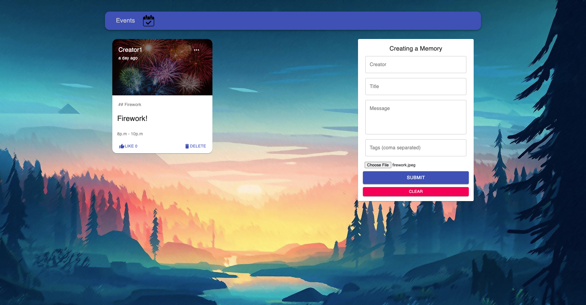

# GoEvents

https://goevents.netlify.app/

GoEvents allows you to CRUD operations by using MERN (MongoDB, Express, Node.js, Node.js).





## Usage
Run
```
npm install
npm start
```

for both 'client' and 'server' folders.

-----

